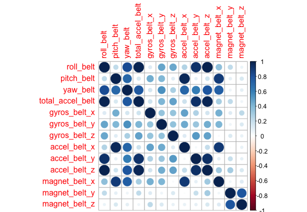
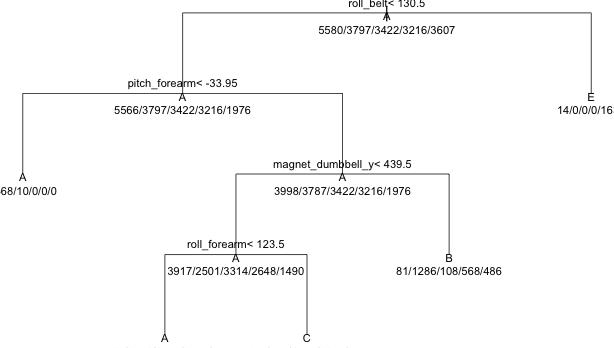

##Overview
The purpose of this analysis is to use data from accelerometers on a bell, forearm, arm and dumbbell of six participant to predict how well the participant do barbell lifts in 5 different ways. the outcome will be the variable __classe__, class A corresponds to the specified execution of the exercise, while the other 4 classes correspond to common mistakes.
In order to analyze the correlation between the different groups of variables, we need to install __corrplot__ package

```{r, echo=FALSE}
require(caret)
require(corrplot)
require(rpart)
library(caret)
library(corrplot)
library(rpart)

```

##Data Preparation
we download the training and test data from the repository
```{r, echo=FALSE}
setwd("~/Documents/Coursera/8_Practical Machine Learning/Week3/Assignment/rmd")
# download.file(url = "http://d396qusza40orc.cloudfront.net/predmachlearn/pml-training.csv", destfile = "pml-training.csv", quiet = TRUE)
# download.file(url = "http://d396qusza40orc.cloudfront.net/predmachlearn/pml-testing.csv", destfile = "pml-test.csv", quiet = TRUE)
```

before we import the file, we open the files and named the first column as "id", so the load command use the first row as the name of the columns in the data set.

```{r, echo=FALSE}
#pml.training <- read.csv("pml-training_Carlitos.csv", header = TRUE)
pml.training <- read.csv("pml-training.csv", header = TRUE)
pml.testing <- read.csv("pml-test.csv", header = TRUE)
```

##Predictors Selection
Eliminate columns with zero variance or too many NA or empty values, as a result we reduce the number of variables from 160 to 53

```{r, echo=FALSE}
pml.training.clean <- pml.training
drop <- c("id", "raw_timestamp_part_1", "raw_timestamp_part_2" ,"cvtd_timestamp" ,"new_window" ,"num_window" ,"max_roll_belt" ,"max_picth_belt" ,"max_yaw_belt" ,"min_roll_belt" ,"min_pitch_belt" ,"min_yaw_belt" ,"amplitude_roll_belt" ,"amplitude_pitch_belt" ,"amplitude_yaw_belt" ,"var_total_accel_belt" ,"avg_roll_belt" ,"stddev_roll_belt" ,"var_roll_belt" ,"avg_pitch_belt" ,"stddev_pitch_belt" ,"var_pitch_belt" ,"avg_yaw_belt" ,"stddev_yaw_belt" ,"var_yaw_belt" ,"var_accel_arm" ,"avg_roll_arm" ,"stddev_roll_arm" ,"var_roll_arm" ,"avg_pitch_arm" ,"stddev_pitch_arm" ,"var_pitch_arm" ,"avg_yaw_arm" ,"stddev_yaw_arm" ,"var_yaw_arm" ,"kurtosis_roll_arm" ,"kurtosis_picth_arm" ,"kurtosis_yaw_arm" ,"skewness_roll_arm" ,"skewness_pitch_arm" ,"skewness_yaw_arm" ,"max_roll_arm" ,"max_picth_arm" ,"max_yaw_arm" ,"min_roll_arm" ,"min_pitch_arm" ,"min_yaw_arm" ,"amplitude_roll_arm" ,"amplitude_pitch_arm" ,"amplitude_yaw_arm" ,"kurtosis_roll_dumbbell" ,"kurtosis_picth_dumbbell" ,"kurtosis_yaw_dumbbell" ,"skewness_roll_dumbbell" ,"skewness_pitch_dumbbell" ,"skewness_yaw_dumbbell" ,"max_roll_dumbbell" ,"max_picth_dumbbell" ,"max_yaw_dumbbell" ,"min_roll_dumbbell" ,"min_pitch_dumbbell" ,"min_yaw_dumbbell" ,"amplitude_roll_dumbbell" ,"amplitude_pitch_dumbbell" ,"amplitude_yaw_dumbbell" ,"var_accel_dumbbell" ,"avg_roll_dumbbell" ,"stddev_roll_dumbbell" ,"var_roll_dumbbell" ,"avg_pitch_dumbbell" ,"stddev_pitch_dumbbell" ,"var_pitch_dumbbell" ,"avg_yaw_dumbbell" ,"stddev_yaw_dumbbell" ,"var_yaw_dumbbell" ,"kurtosis_roll_forearm" ,"kurtosis_picth_forearm" ,"kurtosis_yaw_forearm" ,"skewness_roll_forearm" ,"skewness_pitch_forearm" ,"skewness_yaw_forearm" ,"max_roll_forearm" ,"max_picth_forearm" ,"max_yaw_forearm" ,"min_roll_forearm" ,"min_pitch_forearm" ,"min_yaw_forearm" ,"amplitude_roll_forearm" ,"amplitude_pitch_forearm" ,"amplitude_yaw_forearm" ,"total_accel_forearm" ,"var_accel_forearm" ,"avg_roll_forearm" ,"stddev_roll_forearm" ,"var_roll_forearm" ,"avg_pitch_forearm" ,"stddev_pitch_forearm" ,"var_pitch_forearm" ,"avg_yaw_forearm" ,"stddev_yaw_forearm" ,"var_yaw_forearm", "kurtosis_roll_belt" ,"kurtosis_picth_belt" ,"kurtosis_yaw_belt" ,"skewness_roll_belt" ,"skewness_roll_belt.1" ,"skewness_yaw_belt")
pml.training.clean <- pml.training[, !(names(pml.training) %in% drop)]

```

we divide the variables in groups and check the correlation between them
```{r, echo=FALSE}
predictors.belt <- c("roll_belt", "pitch_belt", "yaw_belt", "total_accel_belt", "gyros_belt_x", "gyros_belt_y", "gyros_belt_z", "accel_belt_x", "accel_belt_y", "accel_belt_z", "magnet_belt_x", "magnet_belt_y", "magnet_belt_z")

predictors.arm <- c("roll_arm", "pitch_arm", "yaw_arm", "total_accel_arm", "gyros_arm_x", "gyros_arm_y", "gyros_arm_z", "accel_arm_x", "accel_arm_y", "accel_arm_z", "magnet_arm_x", "magnet_arm_y", "magnet_arm_z")

predictors.dubbell <- c("roll_dumbbell", "pitch_dumbbell", "yaw_dumbbell", "total_accel_dumbbell", "gyros_dumbbell_x", "gyros_dumbbell_y", "gyros_dumbbell_z", "accel_dumbbell_x", "accel_dumbbell_y", "accel_dumbbell_z", "magnet_dumbbell_x", "magnet_dumbbell_y", "magnet_dumbbell_z")

predictors.forearm <- c("roll_forearm", "pitch_forearm", "yaw_forearm", "gyros_forearm_x", "gyros_forearm_y", "gyros_forearm_z", "accel_forearm_x", "accel_forearm_y", "accel_forearm_z", "magnet_forearm_x", "magnet_forearm_y", "magnet_forearm_z")

belt <- pml.training.clean[predictors.belt]
arm <- pml.training.clean[predictors.arm]
dumbbell <- pml.training.clean[predictors.dubbell]
forearm <- pml.training.clean[predictors.forearm]

correlated.belt <- abs(cor(belt))
correlated.arm <- abs(cor(arm))
correlated.forearm <- abs(cor(forearm))
correlated.dumbbell <- abs(cor(dumbbell))
#corrplot(correlated.belt)
#correlated.arm.graph <- corrplot(correlated.arm)
# corrplot(correlated.forearm)
# corrplot(correlated.dumbbell)
```



belt is the sensor were more variables are correlated, afte the same analysis for all the sensor, this is the list of the final variables

```{r, echo= FALSE}
correlated.var <- c("total_accel_belt", "accel_belt_y", "accel_belt_z", "accel_belt_x", "gyros_arm_y", "gyros_dumbbell_z")

pml.training.clean <- pml.training.clean[, !(names(pml.training.clean) %in% correlated.var)]
names(pml.training.clean)
```

##Modeling

The choose algorith for the model is __regression and classification tree__ 

```{r}

modelFit.lm <- train( classe ~ ., method = "rpart", data=pml.training.clean)
print(modelFit.lm)
print(modelFit.lm$finalModel)
# plot(modelFit.lm$finalModel, uniform = TRUE, main="Classification Tree", cex = .8)
# text(modelFit.lm$finalModel, use.n = TRUE, all = TRUE, cex = .7)

```



##Model Test

```{r}
#predict.lm <- predict(modelFit.lm, newdata = pml.testing)
```